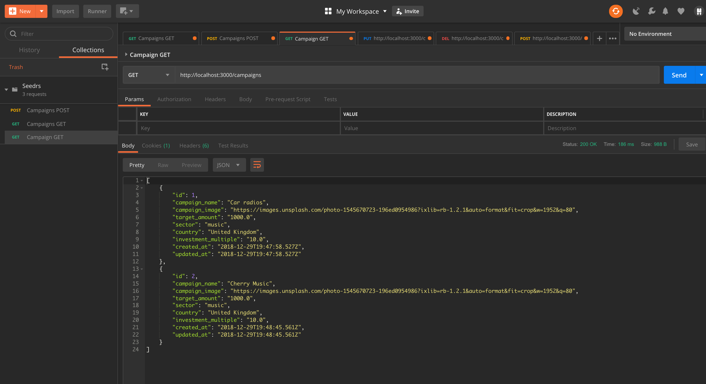

# Seedrs tech test

A tech test from Seedrs that asked for a backend data model of a mini Seedrs, with data for campaigns and Investments including the use of a database store. Task requirements shown below.

Tags: Ruby, TDD, Ruby on Rails, OOP, PostgreSQL, CRUD, RSpec

## Requirements

Implement a mini Seedrs with a focus on the backend and data model. It is expected you model your domain, have some classes to perform some actions and have some testing on expected behaviour (for example Rspec or other). 
Campaigns have the following properties

* Campaign name
* Campaign image (this can be a URL sourced by you)
* Percentage raised
* Target Amount
* Sector
* Country
* Investment multiple 
* Re-iterate that you should deliver the backend part of the solution.
* You should implement some sort of data store. E.g. when the code performs an investment that
should be persistent.
* The solution should be implemented on your language / framework of choice.
* You should seed your data with at least 20 campaigns.
* BONUS: Your solution could be be Dockerized - if you go down this route, it is expected that
you include a Dockerfile / docker-compose on your files and clear instructions on how to run it
in a local environment.
* Your solution should include a README file with step by step instructions on how to “run” it.

### Approach

I started by thinking about the object design for this tech test. I imagine it will have a main campaign object that will instantiate with some basic information the user will have to provide like the campaign name, image url, target amount, investment multiple, sector and country and an empty array that will contain all the investment objects that are created. The investment object as the second object which i would inject into the initialize method.

You can view my initial tested object model [here](https://github.com/Lucx14/seedrs-object-model)

Once I had that model in place I started to think about creating a usable back end data model with some database storage. I decided to try to build the model as a Ruby on rails API that would use PostgreSQL as the data store and would be able to feed the backend information as Json via the API endpoints to a frontend developer who could then use those to implement a working front end.

### Usage instructions

You will need to create two PostgreSQL databases on your local machine, table names seedrs_development and seedrs_test using the instructions below.

```
$ git clone https://github.com/Lucx14/seedrs-rails-api.git
$ cd seedrs-rails-api
$ bundle install
$ rails server
```

Server should now be open on localhost:3000

### Setting up the local databases

I have used psql to connect to a local postgreSQL relational database on my machine. To interact with this program you will need to do the same. Please follow these steps in the terminal

* Connect to psql
* Create the database using the psql command `CREATE DATABASE seedrs_development;`
* Create a test database using psql command `CREATE DATABASE seedrs_test;`

You should then be able to run the rails database comands

```
$ rails db:migrate
$ bin/rails db:migrate RAILS_ENV=test
```

Your local databases should now be formatted correctly for both Dev and test 

### Database model

#### Table name: campaigns

| Column name   |  Data type     |
| ------------- | -------------- |
| id            | int8           |
| campaign_name          | varchar   |
| campaign_image    | varchar      |
| target_amount | numeric(15,2) |
| sector | varchar |
| country | varchar |
| investment_multiple | numeric(15,2) |
| created_at | timestamp |
| updated_at | timestamp |

#### campaigns has a one to many relationship with investments

| Column name   |  Data type     |
| ------------- | -------------- |
| id            | int8           |
| investment_amount          | numeric(15,2)   |
| campaign_id    | int8      |
| created_at | timestamp |
| updated_at | timestamp |

### User interaction

Because this is an API the user interaction can be through an app like postman or insomnia.

First make sure that the server is running on a localhost, if not remember to start rails server

In postman for example you should be able to make GET, POST, PUT, DELETE requests to the api and see the results in json format with data flowing to and from the local database

<p align="center"></p>

### To run tests

```
$ rspec
```

```
Campaign
  should have many investments dependent => destroy
  should validate that :campaign_name cannot be empty/falsy
  should validate that :campaign_image cannot be empty/falsy
  should validate that :target_amount cannot be empty/falsy
  should validate that :sector cannot be empty/falsy
  should validate that :country cannot be empty/falsy
  should validate that :investment_multiple cannot be empty/falsy

Investment
  should belong to campaign
  should validate that :investment_amount cannot be empty/falsy

Campaigns API
  GET /campaigns
    returns campaigns
    returns status code 200
  GET /campaigns/:id
    when the record exists
      returns the campaign
      returns status code 200
    when the record does not exist
      returns status code 404
      returns a not found message
  POST /campaigns
    when the request is valid
      creates a campaign
      returns a status code 201
    when the request is not valid
      returns status code 422
      returns a validation failure message
  PUT /campaigns/:id
    when the record exists
      updates the record
      returns status code 204
    when the record does not exist
      returns status code 404
      returns a not found message
  DELETE /campaigns/:id
    returns status code 204

Investments API
  GET /campaigns/:campaign_id/investments
    when campaign exist
      returns status code 200
      returns all campaign investments
    when campaign does not exist
      returns status code 404
      returns a not found message
  GET /campaigns/:campaign_id/investments/:id
    when campaign investment exists
      returns status code 200
      returns the investment
    when campaign investment does not exist
      returns status code 404
      returns a not found message
  POST /campaigns/:campaign_id/investments
    when request attributes are valid
      returns status code 201
    when an invalid request
      returns status code 422
      returns a failure message
  PUT /campaigns/:campaign_id/investments/:id
    when investment exists
      returns status code 204
      updates the investment
    when the investment does not exist
      returns status code 404
      returns a not found message
  DELETE /campaigns/:campaign_id/investments/:id
    returns status code 204

Finished in 1.88 seconds (files took 3.02 seconds to load)
40 examples, 0 failures
```